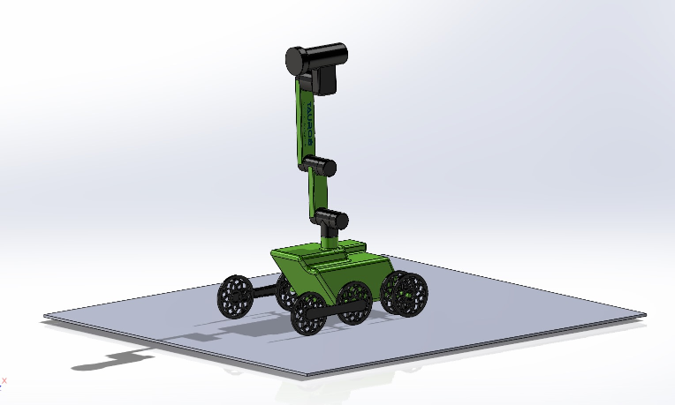
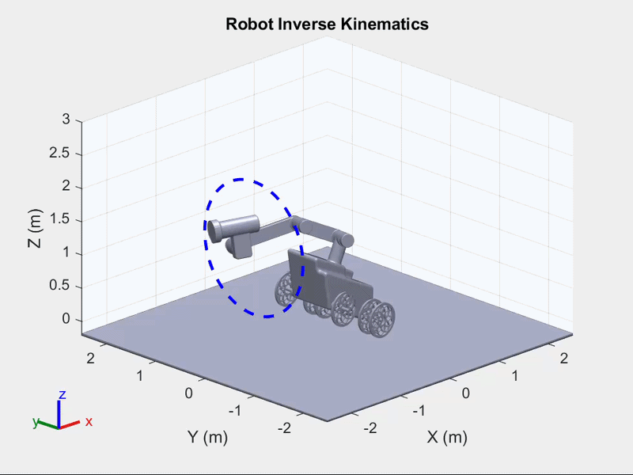
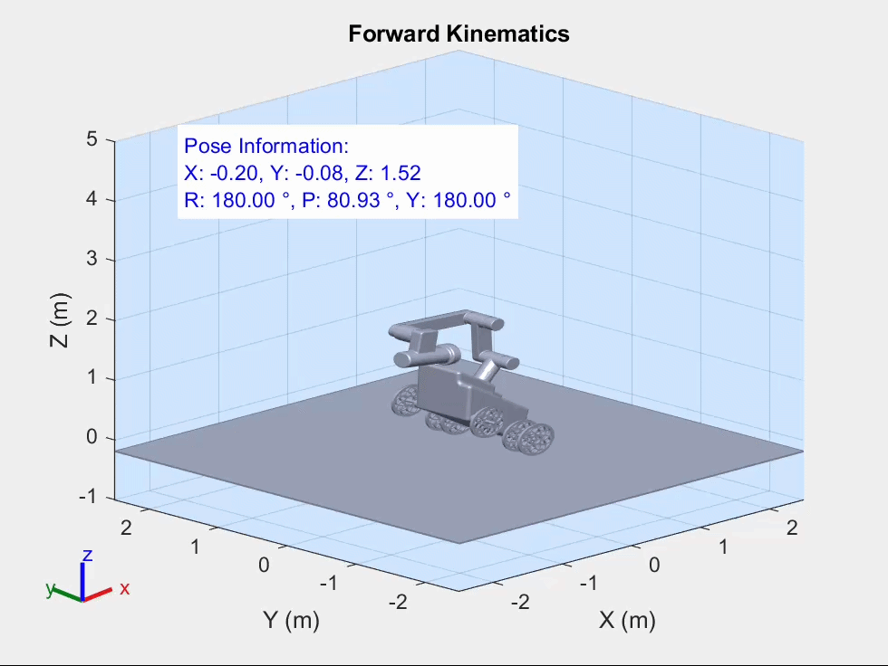

# Taurob Gasfinder Kinematics (MATLAB)

<p align="center">

</p>

This repository contains a kinematic simulation of the **Taurob Gasfinder robotic manipulator** implemented in MATLAB.
This repository contains a kinematic simulation of the **Taurob Gasfinder robotic manipulator** implemented in MATLAB.

The project focuses on modeling and simulating the **forward kinematics (FK)** and **inverse kinematics (IK)** of a multi-body robotic system using MATLAB’s Robotics Toolbox.

The robot model is imported from a URDF file and simulated as a rigid body tree.

## 🎥 Demonstration

<p align="center">


</p>

# Project Overview

The project includes:

- Forward Kinematics simulation  
- Inverse Kinematics trajectory planning  
- End-effector pose computation  
- Robot visualization in 3D  
- Recorded simulation videos  

The goal is to understand the relationship between **joint configurations and end-effector pose** in a serial robotic manipulator.

---

# Inverse Kinematics

The inverse kinematics simulation computes joint configurations required for the end-effector to follow a **circular trajectory in the YZ plane**.

## Features

- MATLAB `inverseKinematics` solver  
- Position and orientation control  
- Circular trajectory planning  
- 3D robot visualization  
- Video export  


---

# Forward Kinematics

The forward kinematics simulation calculates the **end-effector position and orientation** for randomly generated joint configurations within the joint limits.

## Features

- Random joint configurations  
- End-effector pose computation  
- Visualization of the workspace  
- Trajectory recording  

---

# Technologies

- MATLAB  
- Robotics System Toolbox  
- URDF Robot Model  

---

# Repository Structure

```bash
taurob-gasfinder-kinematics-matlab
│
├── Taurob_Gasfinder_Assembly
│
├── forward_kinematics.m
├── inverse_kinematics.m
│
├── robot_forward.mp4
├── robot_trajectory.mp4
│
└── README.md
```

---

# Author

Karim El-Harery
